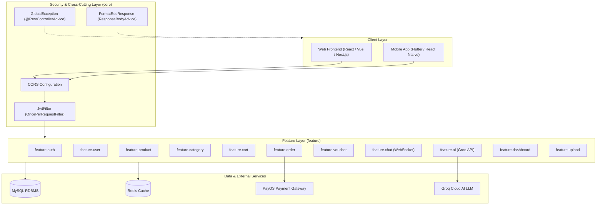
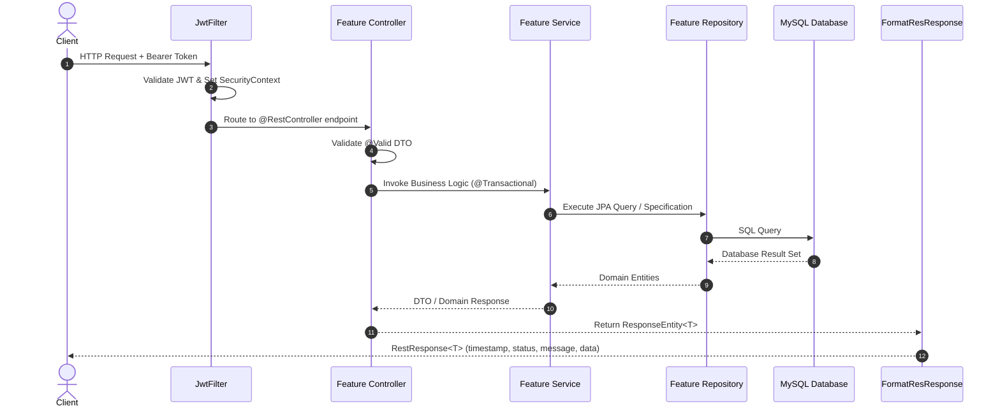
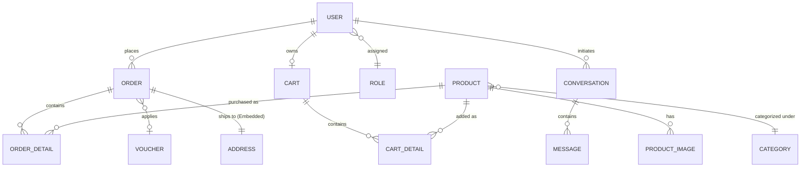
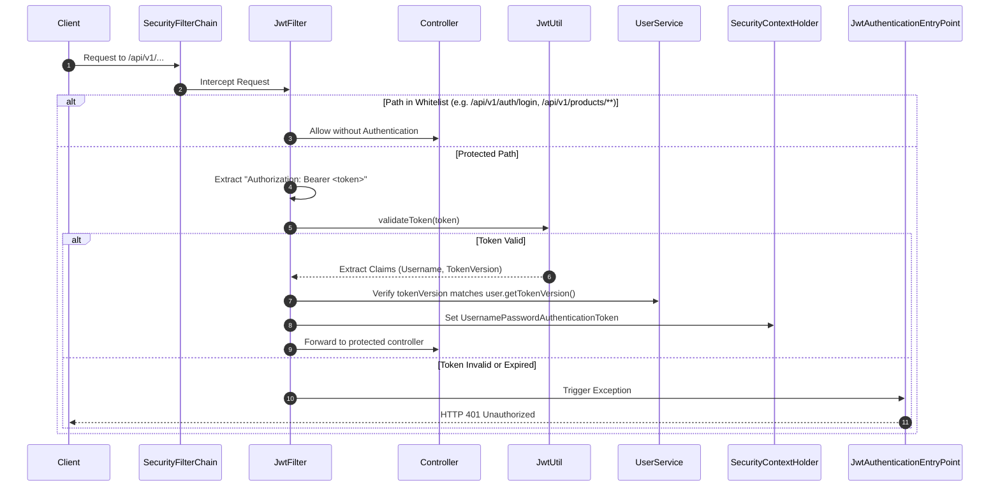

# FOOD ORDER BACKEND - SYSTEM ARCHITECTURE & TECHNICAL SPECIFICATION

> **Version**: 1.0.0  
> **Java Version**: Java 21  
> **Framework**: Spring Boot 3.5.7  
> **Architecture Pattern**: Package-by-Feature (Vertical Slice) & Layered Architecture  
> **Payment Gateway**: PayOS  
> **Security**: Spring Security 6, JWT, Stateless Authentication  
> **Real-time / AI**: Spring WebSocket (STOMP), Spring AI / Groq API

---

## TABLE OF CONTENTS

1. [System Architecture](#1-system-architecture)
   - 1.1 High-Level Architecture Overview
   - 1.2 Package-by-Feature Structure
   - 1.3 Request Flow & Layer Responsibilities
   - 1.4 Technology Stack
2. [Domain Models](#2-domain-models)
   - 2.1 Entity Relationship Diagram (ERD)
   - 2.2 Core Entity Specifications
   - 2.3 Enums
3. [Data Transfer Objects (DTO)](#3-data-transfer-objects-dto)
   - 3.1 Authentication & User DTOs
   - 3.2 Product & Category DTOs
   - 3.3 Cart DTOs
   - 3.4 Order & Payment DTOs
   - 3.5 Chat & Support DTOs
   - 3.6 AI Integration DTOs
   - 3.7 Dashboard & Statistics DTOs
   - 3.8 Common Response Wrappers
4. [Security & Authentication](#4-security--authentication)
   - 4.1 Security Filter Chain & JWT Workflow
   - 4.2 Whitelist & Endpoint Permissions
   - 4.3 WebSocket Security
   - 4.4 Webhook & Payment Security (PayOS)

---

## 1. SYSTEM ARCHITECTURE

### 1.1 High-Level Architecture Overview

The system is structured as a Spring Boot RESTful API serving web and mobile clients. The architecture follows modern enterprise design practices:

- **Clean Separation of Concerns**: Cross-cutting concerns (Security, Exceptions, Formatters) are isolated in `core/`, while business capabilities are partitioned into self-contained `feature/` modules.
- **Vertical Slices**: Each feature packages its controller, service, repository, entity/domain models, specifications, and DTOs together to maximize cohesion and minimize cross-boundary friction.



### 1.2 Package-by-Feature Structure

```text
com.thanh.foodorder/
├── FoodOrderApplication.java
│
├── core/                                 # Shared infrastructure & cross-cutting components
│   ├── configuration/                    # Security, CORS, JWT, WebSocket, PayOS, Redis configs
│   ├── response/                         # RestResponse<T>, ResultPaginationDTO
│   └── util/                             # JwtUtil, DataInitializer, FormatResResponse
│       ├── annotation/                   # @ApiMessage
│       ├── event/                        # Spring application events & listeners
│       └── exception/                    # GlobalException, CommonException
│
└── feature/                              # Vertical business capabilities
    ├── auth/                             # Login, register, token refresh, logout
    ├── user/                             # Users, roles, addresses, specifications
    ├── product/                          # Food menu items, images, stock status
    ├── category/                         # Menu categories & categorization
    ├── cart/                             # Cart management, cart details, items
    ├── order/                            # Order creation, checkout, status, PayOS flow
    ├── voucher/                          # Coupon codes, discount percentages
    ├── chat/                             # Real-time WebSocket support chat & messages
    ├── ai/                               # Groq AI chatbot & smart menu recommendations
    ├── dashboard/                        # Admin statistics, revenue charts, orders
    ├── upload/                           # Multipart file & image uploads
    └── home/                             # Root API health & landing endpoint
```

### 1.3 Request Flow & Layer Responsibilities



1. **Controller**: Validates HTTP payloads (`@Valid`), captures path variables/query parameters, calls the service, and annotates response messages via `@ApiMessage("...")`.
2. **Service**: Contains business logic, manages transaction boundaries (`@Transactional`), enforces invariants (e.g. stock availability, voucher validity), publishes domain events (`OrderCreatedEvent`, `OrderPaidEvent`).
3. **Repository**: Extends `JpaRepository<Entity, ID>` and `JpaSpecificationExecutor<Entity>` for dynamic query composition.
4. **Response Formatting**: `FormatResResponse` implements `ResponseBodyAdvice<Object>`, wrapping any response automatically into `RestResponse<T>`.

### 1.4 Technology Stack

| Component         | Technology                     | Version  | Purpose                                          |
| :---------------- | :----------------------------- | :------- | :----------------------------------------------- |
| **Language**      | Java                           | 21 (LTS) | Modern Java features (Records, Pattern Matching) |
| **Framework**     | Spring Boot                    | 3.5.7    | Application framework                            |
| **ORM / Data**    | Spring Data JPA / Hibernate    | 6.x      | Relational mapping & persistence                 |
| **Database**      | MySQL                          | 8.x      | Primary relational store                         |
| **Cache**         | Redis / Spring Data Redis      | 3.x      | Token caching & session optimization             |
| **Security**      | Spring Security                | 6.x      | Stateless auth, JWT, RBAC                        |
| **JWT**           | JJWT (`jjwt-api`, `jjwt-impl`) | 0.11.5   | HMAC-SHA256 Token issuance & parsing             |
| **Realtime**      | Spring WebSocket (STOMP)       | 3.5.7    | Live customer-support chat                       |
| **Payment**       | PayOS SDK                      | 2.0.1    | VietQR & domestic bank transfers                 |
| **AI**            | Groq API / Spring AI BOM       | 1.1.8    | High-speed LLM chat & recommendations            |
| **Documentation** | SpringDoc OpenAPI (Swagger UI) | 2.8.15   | Interactive API documentation                    |

---

## 2. DOMAIN MODELS

### 2.1 Entity Relationship Diagram (ERD)



### 2.2 Core Entity Specifications

#### 1. `User` (`users` table)

| Field                    | Type                          | Description                     |
| :----------------------- | :---------------------------- | :------------------------------ |
| `id`                     | `Long` (PK, Auto-Increment)   | Primary identifier              |
| `fullName`               | `String` (NotBlank)           | Full name of the user           |
| `email`                  | `String` (NotBlank, Unique)   | User login email address        |
| `password`               | `String` (NotBlank)           | BCrypt hashed password          |
| `phone`                  | `String`                      | Contact phone number            |
| `point`                  | `long`                        | Loyalty points accumulated      |
| `refreshToken`           | `String` (TEXT)               | Long-lived refresh token        |
| `tokenVersion`           | `Integer`                     | Token invalidation counter      |
| `role`                   | `Role` (ManyToOne, `role_id`) | User access role                |
| `orders`                 | `List<Order>` (OneToMany)     | Orders placed by the user       |
| `cart`                   | `Cart` (OneToOne)             | Personal cart instance          |
| `createdAt`, `updatedAt` | `Instant`                     | Audit timestamps                |
| `createdBy`, `updatedBy` | `String`                      | Auditor identity from `JwtUtil` |

#### 2. `Role` (`roles` table)

| Field         | Type        | Description                           |
| :------------ | :---------- | :------------------------------------ |
| `id`          | `Long` (PK) | Role ID                               |
| `name`        | `String`    | Role code (`ROLE_USER`, `ROLE_ADMIN`) |
| `description` | `String`    | Human-readable role description       |

#### 3. `Product` (`products` table)

| Field         | Type                   | Description                                 |
| :------------ | :--------------------- | :------------------------------------------ |
| `id`          | `Long` (PK)            | Product identifier                          |
| `name`        | `String` (NotBlank)    | Food item name                              |
| `price`       | `BigDecimal` (NotNull) | Base price (VND)                            |
| `description` | `String` (TEXT)        | Description and ingredients                 |
| `sold`        | `int`                  | Number of units sold                        |
| `status`      | `ProductStatus` (Enum) | `AVAILABLE`, `OUT_OF_STOCK`, `DISCONTINUED` |
| `category`    | `Category` (ManyToOne) | Food category                               |
| `lstImg`      | `List<ProductImage>`   | Gallery images                              |

#### 4. `Category` (`categories` table)

| Field         | Type        | Description                                 |
| :------------ | :---------- | :------------------------------------------ |
| `id`          | `Long` (PK) | Category ID                                 |
| `name`        | `String`    | Category title (e.g., Pizza, Drink, Burger) |
| `description` | `String`    | Category description                        |

#### 5. `Cart` & `CartDetail` (`carts`, `cart_details` tables)

- `Cart`: Owned by a single `User`. Contains `sum` (total money) and `totalItem`.
- `CartDetail`: Junction entity holding `product_id`, `price`, `quantity`, and back-reference to `cart_id`.

#### 6. `Order` & `OrderDetail` (`orders`, `order_details` tables)

- `Order`:
  - `id`, `orderDate`, `totalPrice`, `discount`, `note`
  - `orderStatus`: `OrderStatus` enum
  - `paymentStatus`: `PaymentStatus` enum
  - `paymentMethod`: `COD`, `PAYOS`
  - `paymentLinkId`, `orderCode`, `expiredAt`: PayOS payment link metadata
  - `address`: `@Embedded Address` (`streetAddress`, `city`, `state`, `postalCode`)
  - `user`: Foreign key to `User`
  - `voucher`: Optional foreign key to `Voucher`
- `OrderDetail`:
  - `id`, `price`, `quantity`, `order`, `product`

#### 7. `Voucher` (`vouchers` table)

- `id`, `code` (Unique), `discountPercent`, `maxDiscount`, `minOrderPrice`, `startDate`, `endDate`, `quantity`.

#### 8. `Conversation` & `Message` (`conversations`, `messages` tables)

- `Conversation`: `id`, `user` (Customer), `status` (`OPEN`, `CLOSED`).
- `Message`: `id`, `content`, `senderRole` (`USER`, `ADMIN`), `createdAt`, `conversation`.

### 2.3 Enums

```java
public enum OrderStatus {
    PENDING, ACCEPTED, PREPARING, SHIPPING, DELIVERED, CANCELLED
}

public enum PaymentStatus {
    PENDING, PAID, FAILED, REFUNDED
}

public enum ProductStatus {
    AVAILABLE, OUT_OF_STOCK, DISCONTINUED
}

public enum ConversationStatus {
    OPEN, CLOSED
}

public enum SenderRole {
    USER, ADMIN
}
```

---

## 3. DATA TRANSFER OBJECTS (DTO)

### 3.1 Authentication & User DTOs

- **`RequestLoginDTO`**: `{ "username": "...", "password": "..." }`
- **`RequestRegisterDTO`**: `{ "fullName": "...", "email": "...", "password": "...", "phone": "..." }`
- **`ResponseLoginDTO`**:
  ```json
  {
    "accessToken": "ey...",
    "user": {
      "id": 1,
      "email": "user@gmail.com",
      "name": "Thanh Nguyen",
      "role": { "id": 2, "name": "ROLE_USER" }
    }
  }
  ```
- **`ResponseUserDTO`**: Sanitized user data without sensitive credentials.
- **`ChangePasswordRequest`**: `{ "oldPassword": "...", "newPassword": "..." }`

### 3.2 Product & Category DTOs

- **`ProductRequestDTO`**: Name, description, price, category ID, list of image URLs.
- **`ProductUpdateRequestDTO`**: Update payload for product info & inventory status.
- **`ResponseProductDTO`**: Complete product projection including category object and image list.

### 3.3 Cart DTOs

- **`CartRequestDTO` / `CartItemRequestDTO`**: Product ID, quantity.
- **`AddToCartResponseDTO`**: Updated item count and total cart price.
- **`CartDetailUserDTO`**: Full breakdown of items in cart for the user view.
- **`MergeCartRequest`**: Synchronizes guest local storage cart with user server cart upon login.

### 3.4 Order & Payment DTOs

- **`CheckoutRequestDTO`**:
  ```json
  {
    "address": {
      "streetAddress": "123 Nguyen Trai",
      "city": "Hanoi",
      "state": "HN",
      "postalCode": "100000"
    },
    "note": "Call before arriving",
    "paymentMethod": "PAYOS",
    "voucherCode": "SALE20"
  }
  ```
- **`OrderResponseDTO`**: Order summary returned after successful placement.
- **`CreatePaymentLinkRequestBody`**: Payload for generating PayOS checkout URL with items, total price, and redirect URLs.
- **`PaymentConfirmRequest`**: PayOS webhook signature verification and status synchronization payload.

### 3.5 Chat & Support DTOs

- **`SendMessageRequest`**: `{ "conversationId": 1, "content": "..." }`
- **`ConversationResponse`**: Conversation thread header with latest message.
- **`MessageResponse`**: Content, timestamp, and sender role (`USER` or `ADMIN`).

### 3.6 AI Integration DTOs

- **`AiChatRequest`**: User natural language query (e.g., _"Suggest a vegetarian meal under 100k"_).
- **`GroqRequest` / `GroqResponse`**: Internal communication with Groq LLM API.
- **`ProductAiResponse`**: AI-extracted search parameters and suggested items matching user intent.

### 3.7 Dashboard & Statistics DTOs

- **`DashboardOverviewResponse`**: Total revenue, total orders, active users, total products.
- **`RevenueByMonthResponse`**: Monthly aggregation for analytics charts.
- **`TopProductResponse`**: Top selling products ranked by quantity sold.
- **`OrderStatusStatistic`**: Breakdown of orders by status.

### 3.8 Common Response Wrappers

All API responses are uniformly wrapped by `FormatResResponse`:

```json
{
  "statusCode": 200,
  "error": null,
  "message": "Call API success",
  "data": { ... }
}
```

For paginated endpoints, data is returned inside `ResultPaginationDTO`:

```json
{
  "meta": {
    "page": 1,
    "pageSize": 10,
    "pages": 5,
    "total": 48
  },
  "result": [ ... ]
}
```

---

## 4. SECURITY & AUTHENTICATION

### 4.1 Security Filter Chain & JWT Workflow

The backend uses **stateless session management** with Spring Security 6.



### 4.2 Whitelist & Endpoint Permissions

The following paths are explicitly public in `SecurityConfiguration`:

- `/api/v1/products/**` (Public catalog view)
- `/api/v1/categories/**` (Public category view)
- `/api/v1/auth/login` (Authentication)
- `/api/v1/auth/register` (Registration)
- `/api/v1/auth/refreshToken` (Token rotation)
- `/api/v1/orders/pay` (Payment link landing)
- `/api/v1/ai/**` (Public recommendation chat)
- `/upload/**` (Uploaded images static resource)
- `/swagger-ui/**`, `/v3/api-docs/**` (OpenAPI docs)
- `/ws/**` (WebSocket STOMP handshake)
- `/api/v1/payos_transfer_handler`, `/api/v1/confirm-webhook` (Payment webhooks)

All other endpoints require authenticated access via Bearer Token.

### 4.3 WebSocket Security

The real-time chat connects at endpoint `/ws`. The connection handshake is authenticated via `WebSocketAuthInterceptor`, which reads and validates the JWT token passed in STOMP headers before allowing session subscription.

### 4.4 Webhook & Payment Security (PayOS)

- Payment link generation produces a cryptographically signed checkout request.
- Webhook callbacks (`/api/v1/confirm-webhook`, `/api/v1/payos_transfer_handler`) are verified using the PayOS Checksum Key to prevent fraudulent order status manipulation.
- Once verified, the system triggers `OrderPaidEvent` via Spring's `ApplicationEventPublisher`, automatically updating payment status, reducing stock, and notifying listeners.
